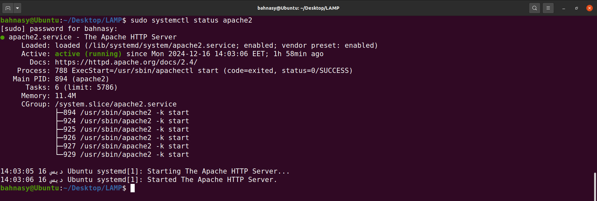
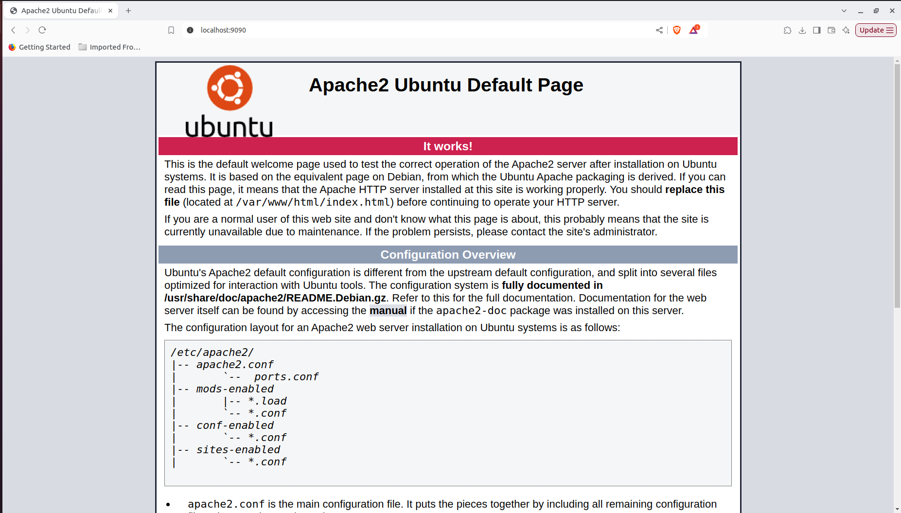
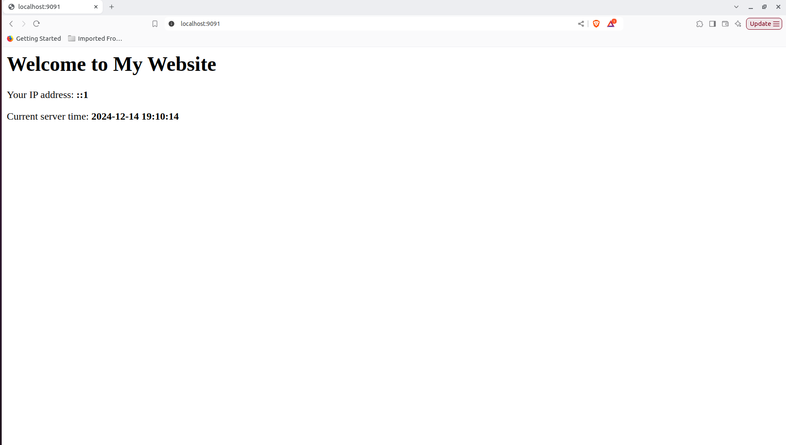
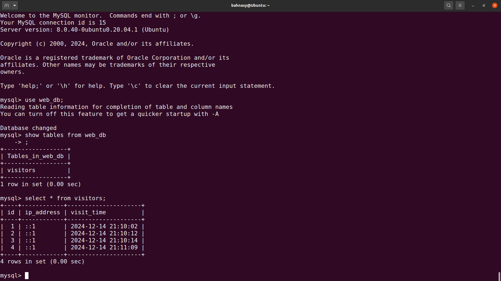
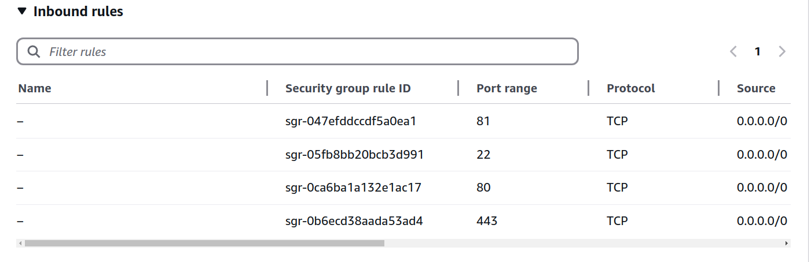

# 🚀 Setting Up a Web Server with LAMP 🚀

   

This guide provides step-by-step instructions for setting up a basic LAMP (Linux, Apache, MySQL, PHP) stack on a Linux server. By the end, you will have a functional web server hosting a PHP-based webpage integrated with a MySQL database and accessible via a public URL.

---

## 📋 Table of Contents 📋

1. [🛠️ Installation 🛠️](#1-️-installation-️)
2. [⚙️ Configuration ⚙️](#2-️-configuration-️)
3. [🌐 Making the Website Public 🌐](#3--making-the-website-public-)
4. [📚 Networking Basics 📚](#4--networking-basics-)
5. [👤 Author 👤](#5--author-)

---

## 1. 🛠️ Installation 🛠️

### 1.1 🔧 Installing Apache, MySQL, and PHP 🔧
To install Apache, MySQL, and PHP on an Ubuntu local machine, run the following commands:

```bash
sudo apt-get update
sudo apt-get install apache2 mysql-server php libapache2-mod-php php-mysql
```

### 1.2 ✅ Verifying Apache Installation ✅
To ensure Apache is active, run:

```bash
sudo systemctl status apache2
```

You should see an output indicating Apache is active and running.  



### 1.3 🌐 Testing the Default Configuration 🌐
To test the default configuration:

1. Open the Apache configuration file `ports.conf` and modify the `Listen` directive from port `80` to `9090`:
    ```
    Listen 9090
    ```
   Save the file and restart Apache:
    ```bash
    sudo systemctl restart apache2
    ```

2. Open your browser and navigate to:
    ```
    http://localhost:9090
    ```
3. You should see the default Apache page.  


### 1.4 🔒 Securing MySQL 🔒
Run the following command to securely install MySQL and follow the prompts:

```bash
sudo mysql_secure_installation
```

---

## 2. ⚙️ Configuration ⚙️

### 2.1 🔧 Modifying Apache Configuration 🔧
1. Open `/etc/apache2/ports.conf` and add the line:
    ```
    Listen 9091
    ```
2. Create a new configuration file in `/etc/apache2/sites-available/` named `my-new-config.conf` and add the following:

    ```
    <VirtualHost *:9091>
        DocumentRoot /var/www/html
        ErrorLog ${APACHE_LOG_DIR}/error.log
        CustomLog ${APACHE_LOG_DIR}/access.log combined
    </VirtualHost>
    ```

3. Enable the new configuration:
    ```bash
    sudo a2ensite my-new-config.conf
    ```

### 2.2 📝 Creating a PHP Page 📝
Create the `index.php` file in the specified directory and add the following code:

```php
<?php
echo "Hello World";
?>
```

Visit the URL `http://localhost:9091` to verify the configuration. You should see the message "Hello World" displayed.  


### 2.3 🗄️ Setting Up the Database 🗄️

1. Log in to MySQL:
    ```bash
    sudo mysql
    ```
2. Create a database and user:
    ```sql
    CREATE DATABASE web_db;
    USE web_db;
    CREATE USER 'web_user'@'localhost' IDENTIFIED BY 'StrongPassword123';
    GRANT ALL PRIVILEGES ON web_db.* TO 'web_user'@'localhost';
    FLUSH PRIVILEGES;
    ```

### 2.4 🔗 Connecting PHP to MySQL 🔗
Update `index.php` to include the following:

```php
<?php
try {
    $pdo = new PDO('mysql:host=localhost;dbname=web_db', 'web_user', 'StrongPassword123');
    $ip_address = $_SERVER['REMOTE_ADDR'];
    $pdo->exec("CREATE TABLE IF NOT EXISTS visitors (
        id INT AUTO_INCREMENT PRIMARY KEY,
        ip_address VARCHAR(45),
        visit_time TIMESTAMP DEFAULT CURRENT_TIMESTAMP
    )");
    $pdo->prepare("INSERT INTO visitors (ip_address) VALUES (?)")->execute([$ip_address]);
    echo "Welcome! Your IP address is $ip_address. Current server time is " . date('Y-m-d H:i:s');
} catch (PDOException $e) {
    echo "Error: " . $e->getMessage();
}
?>
```

### 2.5 🧪 Testing Locally 🧪
Visit the URL `http://localhost:9091`. You should see visitor details, including the IP address and the server time.  



### 2.6 🛠️ Checking the Database 🛠️
Verify the database entries:

```bash
sudo mysql
USE web_db;
SELECT * FROM visitors;
```

You should see the table recording visitor information.  



---

## 3. 🌐 Making the Website Public 🌐

### 3.1 🖥️ Configuring a Cloud Instance 🖥️
1. Log in to the AWS Management Console and navigate to the EC2 dashboard.
2. Launch an instance with the following specifications:
    - **OS**: Ubuntu
    - **Instance Type**: t3.micro
    - **Storage**: 8GB
3. Allow **SSH** and **HTTP** connections.
4. Create a key pair and save the private key locally.
5. Launch the instance.

### 3.2 🔒 Configuring Security Groups 🔒
1. Create a security group named `LAMP Security Group` that allows inbound traffic on port 81.
2. Attach the security group to the instance.  



### 3.3 🔗 Connecting to the Instance 🔗
Connect to the instance via SSH:

```bash
ssh -i /path/to/your-key.pem ubuntu@<public-dns>
```


### 3.4 🌍 Hosting the Website 🌍
Repeat the installation and configuration steps on the cloud instance. Verify that the website is accessible at:

```
http://13.60.6.218:81
```


---

## 4. 📚 Networking Basics 📚

### 4.1 🌐 IP Address 🌐
An IP address uniquely identifies a device on a network. Public IP addresses enable internet communication, while private IPs are used within local networks.  

- **Public IP**: Makes the server accessible to external users.
- **Private IP**: Restricts communication to a local network.
- **Dynamic IPs**: Assigned temporarily by ISPs or networks.
- **Static IPs**: Permanent and suitable for servers requiring consistent identification.

### 4.2 🔄 MAC Address 🔄
A MAC address identifies a device’s network interface card and operates at the Data Link Layer. It is used for local communication and differs from IP addresses, which enable cross-network communication.  

- **Role**: Allows communication between devices on the same local network.
- **Structure**: 48-bit address, often displayed in hexadecimal (e.g., 00:1A:2B:3C:4D:5E).
- **Limitations**: MAC addresses are immutable and do not work across networks without translation.

### 4.3 ⚙️ Switches, Routers, and Routing Protocols ⚙️

- **Switches**: Operate at the Data Link Layer to connect devices in a LAN. They use MAC addresses for forwarding.
- **Routers**: Operate at the Network Layer to connect multiple networks and direct traffic using IP addresses.
- **Routing Protocols**: Algorithms like OSPF, BGP, and RIP define efficient paths for data to travel between networks.
- **NAT (Network Address Translation)**: A method routers use to map private IPs to a public IP for internet communication.

### 4.4 🔗 Remote Connection to Cloud Instance 🔗
To connect to a remote cloud-based Linux instance (e.g., AWS EC2), follow these steps:

1. **Launch an EC2 Instance**: Set up the instance with appropriate configurations (e.g., Ubuntu, t3.micro, and key pair).
2. **Download Key Pair**: Save the private key (`.pem` file) securely to your local machine.
3. **Configure Security Group**: Ensure inbound rules allow SSH traffic on port 22.
4. **Connect via SSH**: Use the following command, replacing `<path-to-key>`, `<user>`, and `<public-IP>` with your key path, username (e.g., `ubuntu`), and the instance’s public IP:
   ```bash
   ssh -i <path-to-key> <user>@<public-IP>
   ```
5. **Verify Connection**: Upon connection, you should access the instance’s terminal remotely.

---

## 5. 👤 Author 👤

**Hassan Ahmed Fathy, El Bahnasy**  
- [LinkedIn](https://www.linkedin.com/in/hassanbahnasy/)  
- [GitHub](https://github.com/Bahnasy2001)  
- Contact: hassanbahnasy872@gmail.com
